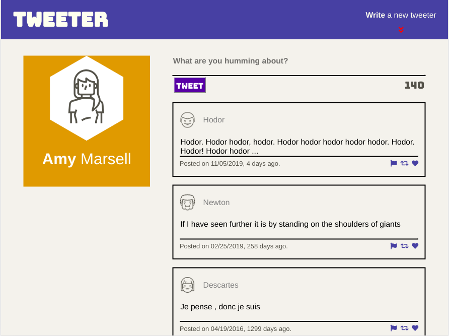

# Tweeter Project

Tweeter is a simple, single-page Twitter clone.

This repository is the starter code for the project: Students will fork and clone this repository, then build upon it to practice their HTML, CSS, JS, jQuery and AJAX front-end skills, and their Node, Express and MongoDB back-end skills.

## Getting Started

1. Fork this repository, then clone your fork of this repository.
2. Install dependencies using the `npm install` command.
3. Start the web server using the `npm run local` or `npm start`command. The app will be served at <http://localhost:8080/>.
4. Go to <http://localhost:8080/> in your browser.

## Dependencies

- Express
- Node 5.10.x or above

## Features

- Responsive Design: 
  1. Flex box layout and em, % are used for auto-adjustment of font-size, image-size on some occasions;
  2. viewport and media query breakpoints: 
     - by width: 100-767, 768-1024, 1024+;
     - by orientation: landsacpe dectect and page adjustment (hide the header) for small screen

- Screenshots: 
  * Link: [More Screenshots with large GIFs](./screentshots/)

  * Exmaple Snapshot: 
   1.
   2. 
   3.